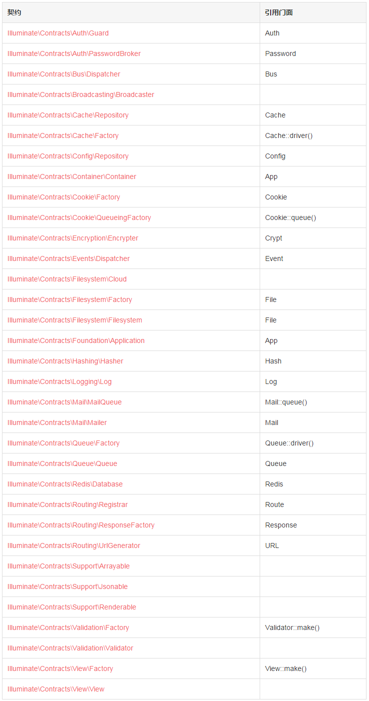

# 契约

# 1、简介
Laravel 的契约是指框架提供的一系列定义核心服务的接口。比如，Illuminate\Contracts\Queue\Queue 契约定义了队列任务需要的方法，Illuminate\Contracts\Mail\Mailer 契约定义了发送邮件所需要的方法。
每一个契约都有框架提供的相应实现。比如，Laravel 提供了多个驱动的队列实现，邮件实现则由 SwiftMailer 驱动。
所有的 Laravel 契约都有其 GitHub 库，这为所有有效的契约提供了快速入门指南，同时也可以作为独立、解耦的包被包开发者使用。
## 1.1 契约（Contracts） VS 门面（Facades）
Laravel 的门面为 Laravel 服务的使用提供了一个简便的方式——不再需要从服务容器中类型提示和解析契约。然而，使用契约允许你为类定义明确的依赖，在大多数应用中，使用门面刚刚好，但是，如果你需要更多更多松耦合，那么契约无疑是合适的，继续看下去！
# 2、为什么使用契约？
关于契约你可能存有疑问。为什么不直接全部使用接口？难道使用接口不是更复杂？让我们从这两个因素来提取使用接口的原因：松耦合和简单。
## 2.1 松耦合
首先，让我们看看一些缓存实现的紧耦合代码：

```
<?php

namespace App\Orders;

class Repository{
    /**
     * 缓存
     */
    protected $cache;

    /**
     * 创建一个新的 Repository 实例
     *
     * @param  \SomePackage\Cache\Memcached  $cache
     * @return void
     */
    public function __construct(\SomePackage\Cache\Memcached $cache)
    {
        $this->cache = $cache;
    }

    /**
     * 通过 ID 获取订单
     *
     * @param  int  $id
     * @return Order
     */
    public function find($id)
    {
        if ($this->cache->has($id))    {
            //
        }
    }
}
```

在这个类中，代码和给定缓存实现紧密耦合，因为我们基于一个来自包的具体的缓存类，如果报的 API 变了，那么相应的，我们的代码必须做修改。
类似的，如果我们想要替换底层的缓存技术（Memcached）为别的技术实现（Redis），我们将再一次不得不修改我们的代码库。我们的代码库应该并不知道谁提供的数据或者数据是怎么提供的。
我们可以基于一种简单的、与提供者无关的接口来优化我们的代码，从而替代上述那种实现：

```
<?php

namespace App\Orders;

use Illuminate\Contracts\Cache\Repository as Cache;

class Repository{
    /**
     * 创建一个新的 Repository 实例
     *
     * @param  Cache  $cache
     * @return void
     */
    public function __construct(Cache $cache)
    {
        $this->cache = $cache;
    }
}
```

现在代码就不与任何特定提供者耦合，甚至与 Laravel 都是无关的。由于契约包不包含任何实现和依赖，你可以轻松的为给定契约编写可选实现代码，你可以随意替换缓存实现而不用去修改任何缓存消费代码。
## 2.2 简单
当所有 Laravel 服务都统一在简单接口中定义，很容易判断给定服务提供的功能。契约可以充当框架特性的简明文档。
此外，基于简单接口，代码也更容易理解和维护。在一个庞大而复杂的类中，与其追踪哪些方法时有效的，不如转向简单、干净的接口。
# 3、契约列表
下面是 Laravel 契约列表，以及其对应的“门面”



# 4、如何使用契约
那么，如果获取一个契约的实现呢？相当简单。
Laravel 中大部分类是通过服务容器进行解析的，包括控制器、事件监听器、中间件、队列任务，甚至路由闭包等。因此，想要获取一个契约的实现，可以在被解析的类的构造函数中类型提示该契约接口。
例如，看看事件监听器的代码：

```
<?php

namespace App\Listeners;

use App\User;
use App\Events\NewUserRegistered;
use Illuminate\Contracts\Redis\Database;

class CacheUserInformation{
    /**
     * Redis 数据库实现
     */
    protected $redis;

    /**
     * 创建一个新的事件处理器实例
     *
     * @param  Database  $redis
     * @return void
     */
    public function __construct(Database $redis)
    {
        $this->redis = $redis;
    }

    /**
     * 处理事件
     *
     * @param  NewUserRegistered  $event
     * @return void
     */
    public function handle(NewUserRegistered $event)
    {
        //
    }
}
```

当事件监听器被解析时，服务容器会读取类的构造函数上的类型提示，然后注入适当的值。想要了解更多关于服务容器的相关内容，可以查看其文档。