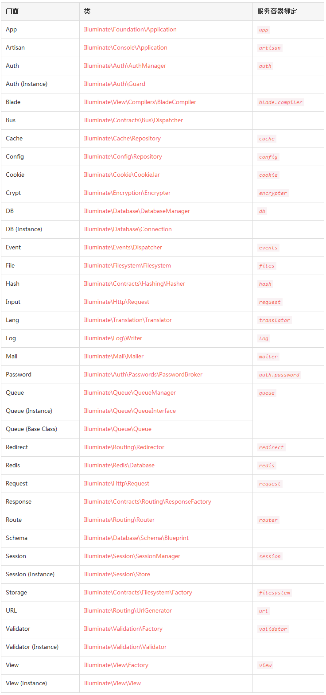

# 门面

## 1、简介
门面为应用的服务容器中的有效类提供了一个“静态”接口。Laravel 附带了很多门面，你可能在不知道的情况下正在使用它们。Laravel 的门面作为服务容器中的底层类的“静态代理”，相比于传统静态方法，在维护时能够提供更加易于测试、更加灵活的、简明且富有表现力的预语法。

## 2、使用门面
在 Laravel 应用的上下文中，门面就是一个提供访问容器中对象的类。该机制原理由 Facade 类实现，Laravel 自带的门面，以及你创建的自定义门面，都会继承自 Illuminate\Support\Facades\Facade 基类。
门面类只需要实现一个方法：getFacadeAccessor。正是 getFacadeAccessor 方法定义了从容器中解析什么，然后 Facade 基类使用魔术方法从你的门面中调用解析对象。

下面的例子中，我们将会调用 Laravel 的缓存系统，浏览代码后，也许你会觉得我们调用了 Cache 的静态方法 get：

```
<?php

namespace App\Http\Controllers;

use Cache;
use App\Http\Controllers\Controller;

class UserController extends Controller{
    /**
     * 为指定用户显示属性
     *
     * @param  int  $id
     * @return Response
     */
    public function showProfile($id)
    {
        $user = Cache::get('user:'.$id);

        return view('profile', ['user' => $user]);
    }
}
```

注意我们在顶部位置引入了 Cache 门面。该门面作为代理访问底层 Illuminate\Contracts\Cache\Factory 接口的实现。我们对门面的所有调用都会被传递给 Laravel 缓存服务的底层实例。

如果我们查看 Illuminate\Support\Facades\Cache 类的源码，将会发现其中并没有静态方法 get：

```
class Cache extends Facade{
    /**
     * 获取组件注册名称
     *
     * @return string
     */
    protected static function getFacadeAccessor() { 
        return 'cache'; 
    }
}
```

Cache 门面继承 Facade 基类并定义了 getFacadeAccessor 方法，该方法的工作就是返回服务容器绑定的名字，当用户引用 Cache 类的任何静态方法时，Laravel 从服务容器中解析 cache 绑定，然后在解析出的对象上调用所有请求方法（本例中是 get）。

## 3、门面类列表
下面列出了每个门面及其对应的底层类，这对深入给定根门面的 API 文档而言是个很有用的工具。服务容器绑定键也被包含进来：

