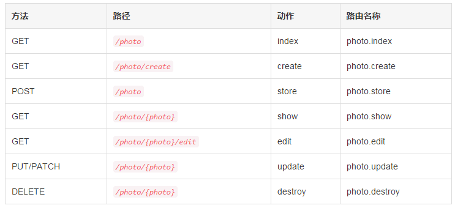

# HTTP 控制器

# 1、简介
将所有的请求处理逻辑都放在单个 routes.php 中肯定是不合理的，你也许还希望使用控制器类组织管理这些行为。控制器可以将相关的HTTP请求封装到一个类中进行处理。通常控制器存放在 app/Http/Controllers 目录中。
# 2、基本控制器
下面是一个基本控制器类的例子。所有的 Laravel 控制器应该继承自 Laravel 自带的控制器基类 Controller：

```
<?php

namespace App\Http\Controllers;

use App\User;
use App\Http\Controllers\Controller;

class UserController extends Controller
{
    /**
     * 为指定用户显示详情
     *
     * @param  int  $id
     * @return Response
     */
    public function showProfile($id)
    {
        return view('user.profile', ['user' => User::findOrFail($id)]);
    }
}
```

我们可以像这样定义指向该控制器动作的路由：

```
Route::get('user/{id}', 'UserController@showProfile');
```

现在，如果一个请求匹配上面的路由 URI，UserController 的 showProfile 方法就会被执行。当然，路由参数也会被传递给这个方法。
## 2.1 控制器&命名空间
你应该注意到我们在定义控制器路由的时候没有指定完整的控制器命名空间，而只是定义了 App\Http\Controllers 之后的部分。默认情况下，RouteServiceProvider 将会在一个路由分组中载入 routes.php 文件，并且该路由分组指定定了分组中路由控制器所在的命名空间。
如果你在 App\Http\Controllers 目录下选择使用 PHP 命名空间嵌套或组织控制器，只需要使用相对于 App\Http\Controllers 命名空间的指定类名即可。因此，如果你的完整控制器类是 App\Http\Controllers\Photos\AdminController，你可以像这样注册路由：

```
Route::get('foo', 'Photos\AdminController@method');
```

## 2.2 命名控制器路由
和闭包路由一样，可以指定控制器路由的名字：

```
Route::get('foo', ['uses' => 'FooController@method', 'as' => 'name']);
```

设置好控制器路由后，就可以使用帮助函数 action 很方便地为控制器动作生成对应的 URL：

```
$url = action('FooController@method');
```

你还可以使用帮助函数 route 来为已命名的控制器路由生成对应的 URL：

```
$url = route('name');
```

# 3、控制器中间件
中间件可以像这样分配给控制器路由：

```
Route::get('profile', [
    'middleware' => 'auth',
    'uses' => 'UserController@showProfile'
]);
```

但是，将中间件放在控制器构造函数中更方便，在控制器的构造函数中使用 middleware 方法你可以很轻松的分配中间件给该控制器。你甚至可以限定该中间件应用到该控制器类的指定方法：

```
class UserController extends Controller
{
    /**
     * 实例化一个新的 UserController 实例
     *
     * @return void
     */
    public function __construct()
    {
        $this->middleware('auth');

        $this->middleware('log', ['only' => ['fooAction', 'barAction']]);

        $this->middleware('subscribed', ['except' => ['fooAction', 'barAction']]);
    }
}
```

# 4、RESTful 资源控制器
Laravel 的资源控制器使得构建围绕资源的 RESTful 控制器变得毫无痛苦，例如，你可能想要在应用中创建一个控制器，用于处理关于图片存储的 HTTP 请求，使用 Artisan 命令 make:controller，我们可以快速创建这样的控制器：

```
php artisan make:controller PhotoController
```

该 Artisan 命令将会生成一个控制器文件 app/Http/Controllers/PhotoController.php，这个控制器包含了每一个资源操作对应的方法。
接下来，可以为该控制器注册一个资源路由：

```
Route::resource('photo', 'PhotoController');
```

这个路由声明包含了处理图片资源 RESTful 动作的多个路由，相应地，Artisan 生成的控制器也已经为这些动作设置了对应的处理方法。
## 4.1 资源控制器处理的动作



## 4.2 只定义部分资源路由
声明资源路由时可以指定该路由处理的动作子集：

```
Route::resource('photo', 'PhotoController',
                ['only' => ['index', 'show']]);

Route::resource('photo', 'PhotoController',
                ['except' => ['create', 'store', 'update', 'destroy']]);
```

## 4.3 命名资源路由
默认情况下，所有资源控制器动作都有一个路由名称，然而，我们可以通过传入 names 数组来覆盖这些默认的名字：

```
Route::resource('photo', 'PhotoController',
                ['names' => ['create' => 'photo.build']]);
```

## 4.4 嵌套资源
有时候我们需要定义路由到“嵌套”资源。例如，一个图片资源可能拥有多条“评论”，要“嵌套”资源控制器，在路由声明中使用“.”号即可：

```
Route::resource('photos.comments', 'PhotoCommentController');
```

该路由将注册一个嵌套的资源，使用 URL 访问方式如下：
photos/{photos}/comments/{comments}.

```
<?php

namespace App\Http\Controllers;

use App\Http\Controllers\Controller;

class PhotoCommentController extends Controller
{
    /**
     * 显示指定照片评论
     *
     * @param  int  $photoId
     * @param  int  $commentId
     * @return Response
     * @translator http://laravelacademy.org
     */
    public function show($photoId, $commentId)
    {
        //
    }
}
```

## 4.5 补充资源控制器
如果有必要在默认资源路由之外添加额外的路由到资源控制器，应该在调用 Route::resource 之前定义这些路由；否则，通过 resource 方法定义的路由可能无意中优先于补充的额外路由：

```
Route::get('photos/popular', 'PhotoController@method');
Route::resource('photos', 'PhotoController');
```

扩展阅读：[实例教程——创建 RESTFul 风格控制器实现文章增删改查](http://laravelacademy.org/post/549.html)

# 5、隐式控制器
Laravel 允许你只定义一个路由即可访问控制器类中的所有动作，首先，使用 Route::controller 方法定义一个路由，该 controller 方法接收两个参数，第一个参数是控制器处理的 baseURI，第二个参数是控制器的类名：

```
Route::controller('users', 'UserController');
```

接下来，添加方法到控制器，方法名应该以 HTTP 请求方法开头：

```
<?php

namespace App\Http\Controllers;

class UserController extends Controller
{
    /**
     * 响应 GET /users 请求
     */
    public function getIndex()
    {
        //
    }

    /**
     * 响应 GET /users/show/1 请求
     */
    public function getShow($id)
    {
        //
    }

    /**
     * 响应 GET /users/admin-profile 请求
     */
    public function getAdminProfile()
    {
        //
    }

    /**
     * 响应 POST /users/profile 请求
     */
    public function postProfile()
    {
        //
    }
}
```

在上例中可以看到，getIndex 方法将会在访问控制器处理的默认 URI——users 时被调用。
## 5.1 分配路由名称
如果你想要命名该控制器中的一些路由，可以将一个名称数组作为第三个参数传递到该 controller 方法：

```
Route::controller('users', 'UserController', [
    'getShow' => 'user.show',
]);
```

# 6、依赖注入 & 控制器
## 6.1 构造函数注入
Laravel 使用服务容器解析所有的 Laravel 控制器，因此，可以在控制器的构造函数中类型声明任何依赖，这些依赖会被自动解析并注入到控制器实例中：

```
<?php

namespace App\Http\Controllers;

use Illuminate\Routing\Controller;
use App\Repositories\UserRepository;

class UserController extends Controller
{
    /**
     * The user repository instance.
     */
    protected $users;

    /**
     * 创建新的控制器实例
     *
     * @param  UserRepository  $users
     * @return void
     */
    public function __construct(UserRepository $users)
    {
        $this->users = $users;
    }
}
```

当然，你还可以类型提示任何 Laravel 契约，如果容器可以解析，就可以进行类型提示。
## 6.2 方法注入
除了构造函数注入之外，还可以在控制器的动作方法中进行依赖的类型提示，例如，我们可以在某个方法中类型提示 Illuminate\Http\Request 实例：

```
<?php

namespace App\Http\Controllers;

use Illuminate\Http\Request;
use Illuminate\Routing\Controller;

class UserController extends Controller
{
    /**
     * 存储新用户
     *
     * @param  Request  $request
     * @return Response
     */
    public function store(Request $request)
    {
        $name = $request->input('name');

        //
    }
}
```

如果控制器方法期望输入路由参数，只需要将路由参数放到其他依赖之后，例如，如果你的路由定义如下：

```
Route::put('user/{id}', 'UserController@update');
```

你需要通过定义控制器方法如下所示来类型提示 Illuminate\Http\Request 并访问路由参数 id：

```
<?php

namespace App\Http\Controllers;

use Illuminate\Http\Request;
use Illuminate\Routing\Controller;

class UserController extends Controller
{
    /**
     * 更新指定用户
     *
     * @param  Request  $request
     * @param  int  $id
     * @return Response
     * @translator http://laravelacademy.org
     */
    public function update(Request $request, $id)
    {
        //
    }
}
```

# 7、路由缓存
如果你的应用完全基于路由使用控制器，可以使用 Laravel 的路由缓存，使用路由缓存将会极大减少注册所有应用路由所花费的时间开销，在某些案例中，路由注册速度甚至能提高 100 倍！想要生成路由缓存，只需执行 Artisan 命令 route:cache:

```
php artisan route:cache
```

就这么简单！你的缓存路由文件现在取代 app/Http/routes.php 文件被使用，记住，如果你添加新的路由需要重新生成路由缓存。因此，只有在项目开发阶段你才会运行 route:cache 命令。
想要移除缓存路由文件，使用 route:clear 命令即可：

```
php artisan route:clear
```