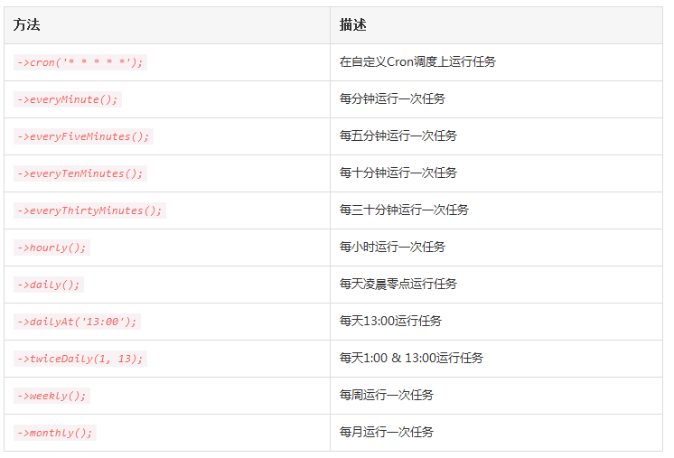
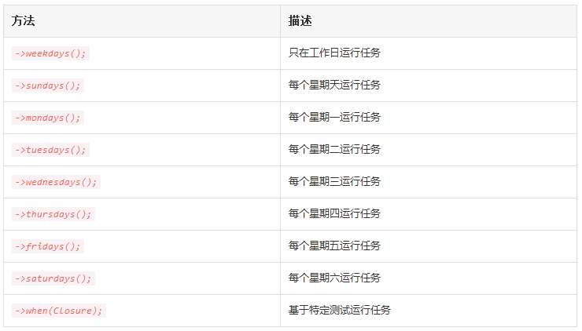

# 任务调度

## 1、简介
在以前，开发者需要为每一个需要调度的任务编写一个 Cron 条目，这是很让人头疼的事。你的任务调度不在源码控制中，你必须使用 SSH 登录到服务器然后添加这些 Cron 条目。Laravel 命令调度器允许你平滑而又富有表现力地在 Laravel 中定义命令调度，并且服务器上只需要一个 Cron 条目即可。

任务调度定义在 app/Console/Kernel.php 文件的 schedule 方法中，该方法中已经包含了一个示例。你可以自由地添加你需要的调度任务到 Schedule 对象。

### 1.1 开启调度
下面是你唯一需要添加到服务器的 Cron 条目：

```
* * * * * php /path/to/artisan schedule:run 1>> /dev/null 2>&1
```

该 Cron 将会每分钟调用 Laravel 命令调度，然后，Laravel 评估你的调度任务并运行到期的任务。

## 2、定义调度
你可以在 App\Console\Kernel 类的 schedule 方法中定义所有调度任务。开始之前，让我们看一个调度任务的例子，在这个例子中，我们将会在每天午夜调度一个被调用的闭包。在这个闭包中我们将会执行一个数据库查询来清空表：

```
<?php

namespace App\Console;

use DB;
use Illuminate\Console\Scheduling\Schedule;
use Illuminate\Foundation\Console\Kernel as ConsoleKernel;

class Kernel extends ConsoleKernel{
    /**
     * 应用提供的 Artisan 命令
     *
     * @var array
     */
    protected $commands = [
        'App\Console\Commands\Inspire',
    ];

    /**
     * 定义应用的命令调度
     *
     * @param  \Illuminate\Console\Scheduling\Schedule  $schedule
     * @return void
     */
    protected function schedule(Schedule $schedule)
    {
        $schedule->call(function () {
            DB::table('recent_users')->delete();
        })->daily();
    }
}
```

除了调度闭包调用外，还可以调度 Artisan 命令和操作系统命令。例如，可以使用 command 方法来调度一个 Artisan 命令：

```
$schedule->command('emails:send --force')->daily();
```

exec 命令可用于发送命令到操作系统：

```
$schedule->exec('node /home/forge/script.js')->daily();
```

### 2.1 调度常用选项
当然，你可以分配多种调度到任务：



这些方法可以和额外的约束一起联合起来创建一周特定时间运行的更加细粒度的调度，例如，要每周一调度一个命令：

```
$schedule->call(function () {
    // 每周星期一13:00运行一次...
})->weekly()->mondays()->at('13:00');
```

下面是额外的调度约束列表：



#### 2.1.1 基于测试的约束条件
when 方法用于限制任务在通过给定测试之后运行。换句话说，如果给定闭包返回 true，只要没有其它约束条件阻止任务运行，该任务就会执行：

```
$schedule->command('emails:send')->daily()->when(function () {
    return true;
});
```

### 2.2 避免任务重叠
默认情况下，即使前一个任务仍然在运行调度任务也会运行，要避免这样的情况，可使用 withoutOverlapping 方法：

```
$schedule->command('emails:send')->withoutOverlapping();
```

在本例中，Artisan 命令 emails:send 每分钟都会运行，如果该命令没有在运行的话。如果你的任务在执行时经常大幅度的变化，那么 withoutOverlapping 方法就非常有用，你不必再去预测给定任务到底要消耗多长时间。

## 3、任务输出
Laravel 调度器为处理调度任务输出提供了多个方便的方法。首先，使用 sendOutputTo 方法，你可以发送输出到文件以便稍后检查：

```
$schedule->command('emails:send')
         ->daily()
         ->sendOutputTo($filePath);
```

使用 emailOutputTo 方法，你可以将输出发送到电子邮件，注意输出必须首先通过 sendOutputTo 方法发送到文件。还有，使用电子邮件发送任务输出之前，应该配置 Laravel 的电子邮件服务：

```
$schedule->command('foo')
         ->daily()
         ->sendOutputTo($filePath)
         ->emailOutputTo('foo@example.com');
```

注意：emailOutputTo 和 sendOutputTo 方法只对 command 方法有效，不支持 call 方法。

## 4、任务钩子
使用 before 和 after 方法，你可以指定在调度任务完成之前和之后要执行的代码：

```
$schedule->command('emails:send')
         ->daily()
         ->before(function () {
             // Task is about to start...
         })
         ->after(function () {
             // Task is complete...
         });
```

### 4.1 ping URL
使用 pingBefore 和 thenPing 方法，调度器可以在任务完成之前和之后自动 ping 给定的 URL。该方法在通知外部服务时很有用，例如Laravel Envoyer，在调度任务开始或完成的时候：

```
$schedule->command('emails:send')
         ->daily()
         ->pingBefore($url)
         ->thenPing($url);
```

使用 pingBefore($url)或 thenPing($url)特性需要安装 HTTP 库Guzzle，可以在 composer.json 文件中添加如下行来安装 Guzzle 到项目：

```
"guzzlehttp/guzzle": "~5.3|~6.0"
```