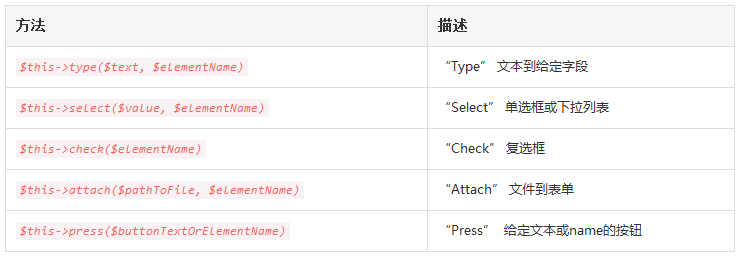

# 测试

# 1、简介
Laravel 植根于测试，实际上，内置使用 PHPUnit 对测试提供支持是即开即用的，并且 phpunit.xml 文件已经为应用设置好了。框架还提供了方便的帮助方法允许你对应用进行富有表现力的测试。
tests 目录中提供了一个 ExampleTest.php 文件，安装完新的 Laravel 应用后，只需简单在命令行运行 phpunit 来运行测试。
## 1.1 测试环境
运行测试的时候，Laravel 自动设置配置环境为 testing。Laravel 在测试时自动配置 session 和 cache 驱动为数组驱动，这意味着测试时不会持久化存储 session 和 cache。
如果需要的话你可以自由创建其它测试环境配置。testing 环境变量可以在 phpunit.xml 文件中配置。
## 1.2 定义&运行测试
要创建一个测试用例，只需简单在 tests 目录创建一个新的测试文件，测试类应该继承 TestCase，然后你可以使用 PHPUnit 定义测试方法。要运行测试，简单从终端执行 phpunit 命令即可：

```
<?php

class FooTest extends TestCase{
    public function testSomethingIsTrue()
    {
        $this->assertTrue(true);
    }
}
```

注意：如果你在测试类中定义自己的 setUp 方法，确保在其中调用 parent::setUp。
# 2、应用测试
Laravel 为生成 HTTP请求、测试输出、以及填充表单提供了平滑的 API。举个例子，我们看下 tests 目录下包含的 ExampleTest.php 文件：

```
<?php

use Illuminate\Foundation\Testing\WithoutMiddleware;
use Illuminate\Foundation\Testing\DatabaseTransactions;

class ExampleTest extends TestCase{
    /**
     * 基本功能测试示例
     *
     * @return void
     */
    public function testBasicExample()
    {
        $this->visit('/')
             ->see('Laravel 5')
             ->dontSee('Rails');
    }
}
```

visit 方法生成了一个 GET 请求，see 方法对我们从应用返回响应中应该看到的给定文本进行断言。dontSee 方法对给定文本没有从应用响应中返回进行断言。在 Laravel 中这是最基本的有效应用测试。
## 2.1 与应用交互
当然，除了对响应文本进行断言之外还有做更多测试，让我们看一些点击链接和填充表单的例子：
### 2.1.1 点击链接
在本测试中，我们将为应用生成请求，在返回的响应中“点击”链接，然后对访问 URI 进行断言。例如，假定响应中有一个“关于我们”的链接：

```
<a href="/about-us">About Us</a>
```

现在，让我们编写一个测试点击链接并断言用户访问页面是否正确：

```
public function testBasicExample(){
    $this->visit('/')
         ->click('About Us')
         ->seePageIs('/about-us');
}
```

### 2.1.2 处理表单
Laravel 还为处理表单提供了多个方法。type, select, check, attach, 和 press 方法允许你与所有表单输入进行交互。例如，我们假设这个表单存在于应用注册页面：

```
<form action="/register" method="POST">
    {!! csrf_field() !!}

    <div>
        Name: <input type="text" name="name">
    </div>

    <div>
        <input type="checkbox" value="yes" name="terms"> Accept Terms
    </div>

    <div>
        <input type="submit" value="Register">
    </div>
</form>
```

我们可以编写测试完成表单并检查结果：

```
public function testNewUserRegistration(){
    $this->visit('/register')
         ->type('Taylor', 'name')
         ->check('terms')
         ->press('Register')
         ->seePageIs('/dashboard');
}
```

当然，如果你的表单包含其他输入比如单选按钮或下拉列表，也可以轻松填写这些字段类型。这里是所有表单操作方法列表：



### 2.1.3 处理附件
如果表单包含 file 输入类型，可以使用 attach 方法添加文件到表单：

```
public function testPhotoCanBeUploaded(){
    $this->visit('/upload')
         ->name('File Name', 'name')
         ->attach($absolutePathToFile, 'photo')
         ->press('Upload')
         ->see('Upload Successful!');
}
```

## 2.2 测试JSON API
Laravel 还提供多个帮助函数用于测试 JSON API 及其响应。例如，get, post, put, patch, 和 delete 方法用于通过多种 HTTP 请求方式发出请求。你还可以轻松传递数据和头到这些方法。作为开始，我们编写测试来生成 POST 请求到/user 并断言返回的数据是否是 JSON 格式：

```
<?php

class ExampleTest extends TestCase{
    /**
     * 基本功能测试示例
     *
     * @return void
     */
    public function testBasicExample()
    {
        $this->post('/user', ['name' => 'Sally'])
             ->seeJson([
                 'created' => true,
             ]);
    }
}
```

seeJson 方法将给定数组转化为 JSON，然后验证应用返回的整个 JSON 响应中的 JSON 片段。因此，如果在 JSON 响应中有其他属性，只要给定片段存在的话测试依然会通过。
### 2.2.1 精确验证 JSON 匹配
如果你想要验证给定数组和应用返回的 JSON 能够精确匹配，使用 seeJsonEquals 方法：

```
<?php

class ExampleTest extends TestCase{
    /**
     * 基本功能测试示例
     *
     * @return void
     */
    public function testBasicExample()
    {
        $this->post('/user', ['name' => 'Sally'])
             ->seeJsonEquals([
                 'created' => true,
             ]);
    }
}
```

## 2.3 Session/认证
Laravel 提供个多个帮助函数在测试期间处理session，首先，可以使用 withSession 方法设置 session 值到给定数组。这通常在测试请求前获取 session 数据时很有用：

```
<?php

class ExampleTest extends TestCase{
    public function testApplication()
    {
        $this->withSession(['foo' => 'bar'])
             ->visit('/');
    }
}
```

当然，session 的通常用于操作用户状态，例如认证用户。帮助函数 actingAs 提供了认证给定用户为当前用户的简单方法，例如，我们使用模型工厂生成和认证用户：

```
<?php

class ExampleTest extends TestCase{
    public function testApplication()
    {
        $user = factory('App\User')->create();

        $this->actingAs($user)
             ->withSession(['foo' => 'bar'])
             ->visit('/')
             ->see('Hello, '.$user->name);
    }
}
```

## 2.4 禁止中间件
测试应用时，为某些测试禁止中间件很方便。这种机制允许你将路由和控制器与中间件孤立开来做测试，Laravel 包含了一个简单的 WithoutMiddleware trait，可以使用该 trait 自动在测试类中禁止所有中间件：

```
<?php

use Illuminate\Foundation\Testing\WithoutMiddleware;
use Illuminate\Foundation\Testing\DatabaseTransactions;

class ExampleTest extends TestCase{
    use WithoutMiddleware;
    //
}
```

如果你只想在某些方法中禁止中间件，可以在测试方法中调用 withoutMiddleware 方法：

```
<?php

class ExampleTest extends TestCase{
    /**
     * 基本功能测试示例
     *
     * @return void
     */
    public function testBasicExample()
    {
        $this->withoutMiddleware();

        $this->visit('/')
             ->see('Laravel 5');
    }
}
```

## 2.5 自定义 HTTP 请求
如果你想要在应用中生成自定义 HTTP 请求并获取完整的 Illuminate\Http\Response 对象，可以使用 call 方法：

```
public function testApplication(){
    $response = $this->call('GET', '/');
    $this->assertEquals(200, $response->status());
}
```

如果你要生成 POST, PUT, 或者 PATCH 请求可以在请求中传入输入数据数组，在路由或控制器中可以通过Request 实例访问请求数据：

```
$response = $this->call('POST', '/user', ['name' => 'Taylor']);
```

# 3、处理数据库
Laravel 还提供了多种有用的工具让测试数据库驱动的应用更加简单。首先，你可以使用帮助函数 seeInDatabase 来断言数据库中的数据是否和给定数据集合匹配。例如，如果你想要通过 email 值为 sally@example.com 的条件去数据表 users 查询是否存在该记录 ，我们可以这样做：

```
public function testDatabase(){
    // 调用应用...
    $this->seeInDatabase('users', ['email' => 'sally@foo.com']);
}
```

## 3.1 每次测试后重置数据库
每次测试后重置数据库通常很有用，这样的话上次测试的数据不会影响下一次测试。
### 3.1.1 使用迁移
一种方式是每次测试后回滚数据库并在下次测试前重新迁移。Laravel 提供了一个简单的 DatabaseMigrations trait 来自动为你处理。在测试类上简单使用该 trait 如下：

```
<?php

use Illuminate\Foundation\Testing\WithoutMiddleware;
use Illuminate\Foundation\Testing\DatabaseMigrations;
use Illuminate\Foundation\Testing\DatabaseTransactions;

class ExampleTest extends TestCase{
    use DatabaseMigrations;

    /**
     * 基本功能测试示例
     *
     * @return void
     */
    public function testBasicExample()
    {
        $this->visit('/')
             ->see('Laravel 5');
    }
}
```

### 3.1.2 使用事务
另一种方式是将每一个测试用例包裹到一个数据库事务中，Laravel 提供了方便的 DatabaseTransactions trait 自动为你处理：

```
<?php

use Illuminate\Foundation\Testing\WithoutMiddleware;
use Illuminate\Foundation\Testing\DatabaseMigrations;
use Illuminate\Foundation\Testing\DatabaseTransactions;

class ExampleTest extends TestCase{
    use DatabaseTransactions;

    /**
     * 基本功能测试示例
     *
     * @return void
     */
    public function testBasicExample()
    {
        $this->visit('/')
             ->see('Laravel 5');
    }
}
```

## 3.2 模型工厂
测试时，通常需要在执行测试前插入新数据到数据库。在创建测试数据时，Laravel 允许你使用”factories”为每个Eloquent 模型定义默认的属性值集合，而不用手动为每一列指定值。作为开始，我们看一下 atabase/factories/ModelFactory.php 文件，该文件包含了一个工厂定义：

```
$factory->define(App\User::class, function (Faker\Generator $faker) {
    return [
        'name' => $faker->name,
        'email' => $faker->email,
        'password' => bcrypt(str_random(10)),
        'remember_token' => str_random(10),
    ];
});
```

在闭包中，作为工厂定义，我们返回该模型上所有属性默认测试值。该闭包接收 PHP 库Faker实例，从而允许你方便地为测试生成多种类型的随机数据。
当然，你可以添加更多工厂到 ModelFactory.php 文件。
### 3.2.1 多个工厂类型
有时候你可能想要为同一个 Eloquent 模型类生成多个工厂，例如，除了正常用户外可能你想要为“管理员”用户生成一个工厂，你可以使用 defineAs 方法定义这些工厂：

```
$factory->defineAs(App\User::class, 'admin', function ($faker) {
    return [
        'name' => $faker->name,
        'email' => $faker->email,
        'password' => str_random(10),
        'remember_token' => str_random(10),
        'admin' => true,
    ];
});
```

你可以使用 raw 方法获取基本属性而不用重复基本用户工厂中的所有属性，获取这些属性后，只需将你要求的额外值增补进去即可：

```
$factory->defineAs(App\User::class, 'admin', function ($faker) use ($factory) {
    $user = $factory->raw(App\User::class);
    return array_merge($user, ['admin' => true]);
});
```

### 3.2.2 在测试中使用工厂
定义好工厂后，可以在测试或数据库填充文件中通过全局的 factory 方法使用它们来生成模型实例，所以，让我们看一些生成模型的例子，首先，我们使用 make 方法，该方法创建模型但不将其保存到数据库：

```
public function testDatabase(){
    $user = factory(App\User::class)->make();
    // 用户模型测试...
}
```

如果你想要覆盖模型的一些默认值，可以传递数组值到 make 方法。只有指定值被替换，其他数据保持不变：

```
$user = factory(App\User::class)->make([
    'name' => 'Abigail',
]);
```

还可以创建多个模型集合或者创建给定类型的集合：

```
// 创建 3 个 App\User 实例...
$users = factory(App\User::class, 3)->make();
// 创建 1 个 App\User "admin" 实例...
$user = factory(App\User::class, 'admin')->make();
// 创建 3 个 App\User "admin" 实例...
$users = factory(App\User::class, 'admin', 3)->make();
```

### 3.2.3 持久化工厂模型
create 方法不仅能创建模型实例，还可以使用 Eloquent 的 save 方法将它们保存到数据库：

```
public function testDatabase(){
    $user = factory(App\User::class)->create();
    //用户模型测试...
}
```

你仍然可以通过传递数组到 create 方法覆盖模型上的属性：

```
$user = factory(App\User::class)->create([
    'name' => 'Abigail',
]);
```

### 3.2.4 添加关联关系到模型
你甚至可以持久化多个模型到数据库。在本例中，我们添加一个关联到创建的模型，使用 create 方法创建多个模型的时候，会返回一个Eloquent 集合实例，从而允许你使用集合提供的所有便利方法，例如 each：

```
$users = factory(App\User::class, 3)
           ->create()
           ->each(function($u) {
                $u->posts()->save(factory(App\Post::class)->make());
            });
```

# 4、模拟
## 4.1 模拟事件
如果你在重度使用 Laravel 的时间系统，可能想要在测试时模拟特定事件。例如，如果你在测试用户注册，你可能不想所有 UserRegistered 的时间处理器都被触发，因为这可能会发送欢迎邮件，等等。
Laravel 提供可一个方便的 expectsEvents 方法来验证期望的事件被触发，但同时阻止该事件的其它处理器运行：

```
<?php

class ExampleTest extends TestCase{
    public function testUserRegistration()
    {
        $this->expectsEvents(App\Events\UserRegistered::class);
        // 测试用户注册代码...
    }
}
```

如果你想要阻止所有事件运行，可以使用 withoutEvents 方法：

```
<?php

class ExampleTest extends TestCase{
    public function testUserRegistration()
    {
        $this->withoutEvents();
        // 测试用户注册代码...
    }
}
```

## 4.2 模拟队列任务
有时候，你可能想要在请求时简单测试控制器分发的指定任务，这允许你孤立的测试路由/控制器——将其从任务逻辑中分离出去，当然，接下来你可以在一个独立测试类中测试任务本身。
Laravel 提供了一个方便的 expectsJobs 方法来验证期望的任务被分发，但该任务本身不会被测试：

```
<?php

class ExampleTest extends TestCase{
    public function testPurchasePodcast()
    {
        $this->expectsJobs(App\Jobs\PurchasePodcast::class);
        // 测试购买播客代码...
    }
}
```

注意：这个方法只检查通过 DispatchesJobs trait 分发方法分发的任务，并不检查直接通过 Queue::push 分发的任务。
## 4.3 模拟门面
测试的时候，你可能经常想要模拟Laravel 门面的调用，例如，看看下面的控制器动作：

```
<?php

namespace App\Http\Controllers;

use Cache;
use Illuminate\Routing\Controller;

class UserController extends Controller{
    /**
     * 显示应用用户列表
     *
     * @return Response
     */
    public function index()
    {
        $value = Cache::get('key');

        //
    }
}
```

我们可以通过使用 shouldReceive 方法模拟 Cache 门面的调用，该方法返回一个Mockery模拟的实例，由于门面通过 Laravel服务容器解析和管理，它们比通常的静态类更具有可测试性。例如，我们来模拟 Cache 门面的调用：

```
<?php

class FooTest extends TestCase{
    public function testGetIndex()
    {
        Cache::shouldReceive('get')
                    ->once()
                    ->with('key')
                    ->andReturn('value');

        $this->visit('/users')->see('value');
    }
}
```

注意：不要模拟 Request 门面，取而代之地，在测试时传递输入到 HTTP 帮助函数如 call 和 post。