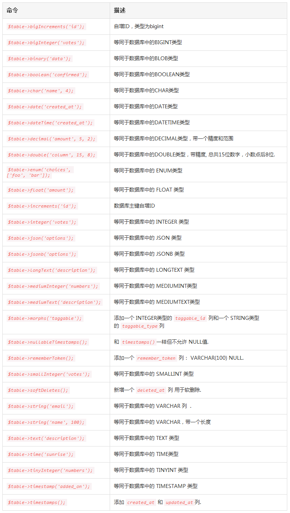
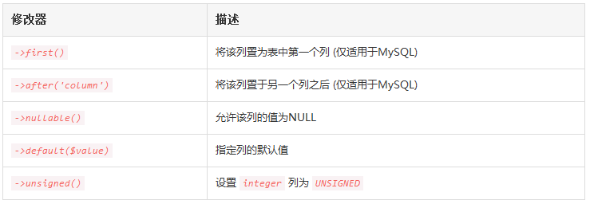
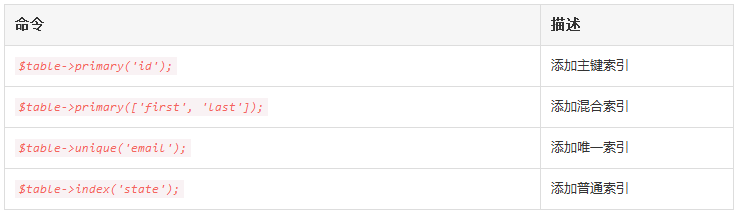
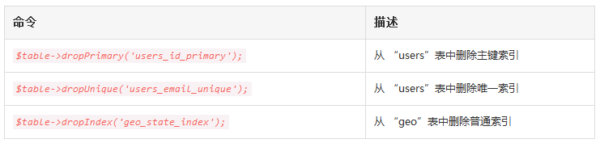

# 迁移

# 1、简介
迁移就像数据库的版本控制，允许团队简单轻松的编辑并共享应用的数据库表结构，迁移通常和 Laravel 的结构构建器结对从而可以很容易地构建应用的数据库表结构。
Laravel 的 `Schema` 门面提供了与数据库系统无关的创建和操纵表的支持，在 Laravel 所支持的所有数据库系统中提供一致的、优雅的、平滑的 API。
# 2、生成迁移
使用 Artisan 命令 `make:migration `来创建一个新的迁移：

```
php artisan make:migration create_users_table
```

新的迁移位于 `database/migrations `目录下，每个迁移文件名都包含时间戳从而允许 Laravel 判断其顺序。
`--table` 和`--create` 选项可以用于指定表名以及该迁移是否要创建一个新的数据表。这些选项只需要简单放在上述迁移命令后面并指定表名：

```
php artisan make:migration add_votes_to_users_table --table=users
php artisan make:migration create_users_table --create=users
```

如果你想要指定生成迁移的自定义输出路径，在执行 `make:migration` 命令时可以使用`--path` 选项，提供的路径应该是相对于应用根目录的。
# 3、迁移结构
迁移类包含了两个方法：`up` 和 `down`。`up` 方法用于新增表，列或者索引到数据库，而 `down `方法就是 `up` 方法的反操作，和 `up `里的操作相反。
在这两个方法中你都要用到 Laravel 的表结构构建器来创建和修改表，想要学习 `Schema` 构建器的更多有用方法，可以查看其文档。例如，让我们先看看创建 `flights` 表的简单示例：

```
<?php

use Illuminate\Database\Schema\Blueprint;
use Illuminate\Database\Migrations\Migration;

class CreateFlightsTable extends Migration{
    /**
     * 运行迁移
     *
     * @return void
     */
    public function up()
    {
        Schema::create('flights', function (Blueprint $table) {
            $table->increments('id');
            $table->string('name');
            $table->string('airline');
            $table->timestamps();
        });
    }

    /**
     * 撤销迁移
     *
     * @return void
     */
    public function down()
    {
        Schema::drop('flights');
    }
}
```

# 4、运行迁移
要运行应用中所有未执行的迁移，可以使用 Artisan 命令的 `migrate `方法。如果你正在使用Homestead 虚拟机，应该在你的虚拟机中运行如下这条命令：

```
php artisan migrate
```

如果再运行时遇到”class not found“的错误提示，尝试运行 `composer dump-autoload` 命令然后重新运行迁移命令。
**在生产环境中强制运行迁移**
有些迁移操作是毁灭性的，这意味着它们可能造成数据的丢失，为了避免在生产环境数据库中运行这些命令，你将会在运行这些命令之前被提示并确认。想要强制运行这些命令而不被提示，可以使用`--force`：

```
php artisan migrate --force
```

## 4.1 回滚迁移
想要回滚最新的一次迁移”操作“，可以使用 `rollback` 命令，注意这将会回滚最后一批运行的迁移，可能包含多个迁移文件：

```
php artisan migrate:rollback
```

`migrate:reset` 命令将会回滚所有的应用迁移：

```
php artisan migrate:reset
```

### 4.1.1 在单个命令中回滚/迁移
`migrate:refresh` 命令将会先回滚所有数据库迁移，然后运行` migrate` 命令。这个命令可以有效的重建整个数据库：

```
php artisan migrate:refresh
php artisan migrate:refresh --seed
```

# 5、编写迁移
## 5.1 创建表
使用` Schema` 门面上的 `create `方法来创建新的数据表。`create `方法接收两个参数，第一个是表名，第二个是获取用于定义新表的` Blueprint `对象的闭包：

```
Schema::create('users', function ($table) {
    $table->increments('id');
});
```

当然，创建新表的时候，可以使用表结构构建器中的任意列方法来定义数据表的列。
### 5.1.1 检查表/列是否存在
你可以轻松地使用 hasTable 和 hasColumn 方法检查表或列是否存在：

```
if (Schema::hasTable('users')) {
    //
}

if (Schema::hasColumn('users', 'email')) {
    //
}
```

### 5.1.2 连接&存储引擎
如果你想要在一个数据库连接上执行表结构操作，该数据库连接并不是默认数据库连接，使用 `connection `方法：

```
Schema::connection('foo')->create('users', function ($table) {
    $table->increments('id');
});
```

要设置表的存储引擎，在表结构构建器上设置 `engine` 属性：

```
Schema::create('users', function ($table) {
    $table->engine = 'InnoDB';
    $table->increments('id');
});
```

## 5.2 重命名/删除表
要重命名一个已存在的数据表，使用 `rename` 方法：

```
Schema::rename($from, $to);
```

要删除一个已存在的数据表，可以使用 `drop` 或 `dropIfExists` 方法：

```
Schema::drop('users');Schema::dropIfExists('users');
```

## 5.3 创建列
要更新一个已存在的表，使用 Schema 门面上的 `table` 方法，和 `create` 方法一样，`table` 方法接收两个参数：表名和获取用于添加列到表的 `Blueprint` 实例的闭包：

```
Schema::table('users', function ($table) {
    $table->string('email');
});
```

### 5.3.1 可用的列类型
当然，表结构构建器包含一系列你可以用来构建表的列类型：



### 5.3.2 列修改器
除了上面列出的列类型之外，在添加列的时候还可以使用一些其它列”修改器“，例如，要使列默认为null，可以使用` nullable` 方法：

```
Schema::table('users', function ($table) {
    $table->string('email')->nullable();
});
```

下面是所有可用的列修改器列表，该列表不包含索引修改器：



## 5.4 修改列
### 5.4.1 先决条件
在修改列之前，确保已经将 `doctrine/dbal` 依赖添加到 `composer.json` 文件，Doctrine  DBAL 库用于判断列的当前状态并在需要时创建 SQL 查询来对列进行指定的调整。

### 5.4.2 更新列属性
`change` 方法允许你修改已存在的列为新的类型，或者修改列的属性。例如，你可能想要增加 string 类型列的尺寸，让我们将 `name` 列的尺寸从25增加到50：

```
Schema::table('users', function ($table) {
    $table->string('name', 50)->change();
});
```

我们还可以修改该列允许 NULL 值：

```
Schema::table('users', function ($table) {
    $table->string('name', 50)->nullable()->change();
});
```

### 5.4.3 重命名列
要重命名一个列，可以使用表结构构建器上的 `renameColumn` 方法，在重命名一个列之前，确保` doctrine/dbal` 依赖已经添加到` composer.json` 文件：
 
```
Schema::table('users', function ($table) {
    $table->renameColumn('from', 'to');
});
```

注意：enum 类型的列的重命名暂不支持。

## 5.5 删除列
要删除一个列，使用表结构构建器上的 `dropColumn` 方法：

```
Schema::table('users', function ($table) {
    $table->dropColumn('votes');
});
```

你可以传递列名数组到` dropColumn` 方法从表中删除多个列：

```
Schema::table('users', function ($table) {
    $table->dropColumn(['votes', 'avatar', 'location']);
});
```

注意：在从 SQLite 数据库删除列之前，需要添加 `doctrine/dbal` 依赖到 `composer.json `文件并在终端中运行 `composer update` 命令来安装该库。

## 5.6 创建索引
表结构构建器支持多种类型的索引，首先，让我们看一个指定列值为唯一索引的例子。要创建索引，可以使用 `unique` 方法：

```
$table->string('email')->unique();
```

此外，你可以在定义列之后创建索引，例如：

```
$table->unique('email');
```

你甚至可以传递列名数组到索引方法来创建混合索引：

```
$table->index(['account_id', 'created_at']);
```

### 5.6.1 可用索引类型



## 5.7 删除索引
要删除索引，必须指定索引名。默认情况下，Laravel 自动分配适当的名称给索引——简单连接表名、列名和索引类型。下面是一些例子：



## 5.8 外键约束
Laravel 还提供了创建外键约束的支持，用于在数据库层面强制引用完整性。例如，我们在 `posts `表中定义了一个引用` users `表的` id `列的` user_id `列：

```
Schema::table('posts', function ($table) {
    $table->integer('user_id')->unsigned();
    $table->foreign('user_id')->references('id')->on('users');
});
```

你还可以为约束的“on delete”和“on update”属性指定期望的动作：

```
$table->foreign('user_id')
      ->references('id')->on('users')
      ->onDelete('cascade');
```

要删除一个外键，可以使用 `dropForeign` 方法。外键约束和索引使用同样的命名规则——连接表名、外键名然后加上”_foreign”后缀：

```
$table->dropForeign('posts_user_id_foreign');
```